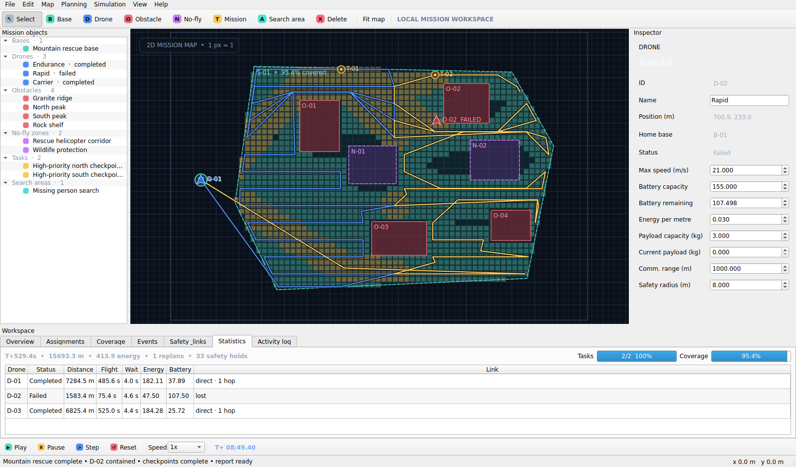
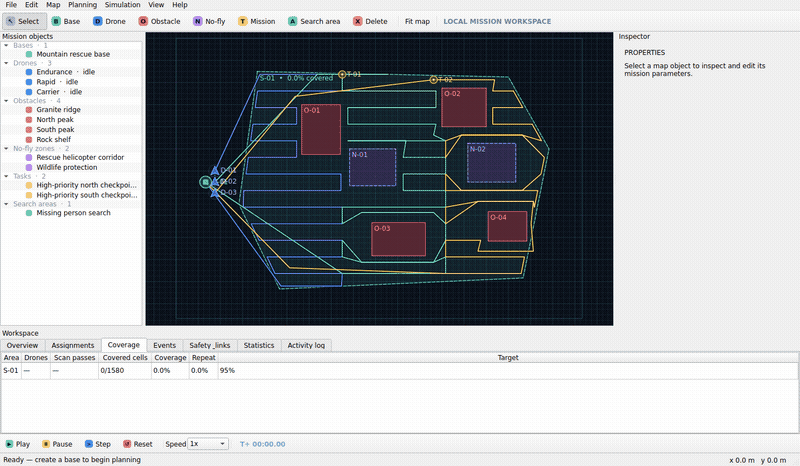

# Drone Mission Planner

**多无人机协同任务规划与动态仿真平台** — a fully local PySide6 desktop application for composing, planning, validating, simulating, and reporting 2D multi-UAV missions. Version 1.0 is software-only: it does not connect to real aircraft or cloud services.



## Demonstration



[Download the MP4 demonstration](docs/media/rescue-demo.mp4) · [Open the generated simulation report](reports/final-simulation-report.html)

## What is included

| Area | Capabilities |
|---|---|
| Mission editor | Zoomable grid map; bases, drones, point missions, obstacles, no-fly zones, polygon/rectangular search areas; inspector and object tree |
| Route planning | Deterministic 8-connected A*, Octile heuristic, safety-radius inflation, corner-cut prevention, smoothing, final validation, and altitude-risk checks |
| 3D waypoints | Every planned route also produces `x/y/altitude` waypoints with MSL/AGL mode, per-waypoint speed, actions (fly/hover/photo/scan/land/RTL), hold times, and task links; the Waypoints tab edits altitude/mode/speed/action/hold and re-computes risks and energy |
| 3D mission view | Read-only software-rendered 3D scene with terrain mesh, 3D routes, obstacle/no-fly volumes, coverage cells, risk segments, wind arrow, orbit camera, layer toggles, camera presets, and cross-view selection sync |
| Assignment | Priority-first multi-drone allocation with payload, terrain/wind-aware energy, safe return, reserve, deadlines, and per-drone rejection reasons |
| Cooperative search | Vertical strip partitioning, obstacle-safe lawnmower passes, incremental supplemental sweeps, return to base, live covered/uncovered-cell overlays, and repeat-coverage metrics |
| Dynamic simulation | Fixed 0.05 s logic steps, 0.5x–10x playback, state machine, altitude/energy/distance/task integration, pause/step/reset |
| Environment | Editable procedural terrain peaks, CSV elevation-grid import, base elevation, global wind vectors, climb/descent/hover power parameters, and a read-only 2.5D terrain view |
| Live adaptation | Manual or seeded automatic failures, exact-position stop, unfinished-work redistribution from live state, coverage recovery without resetting history, temporary zones, task insertion/cancellation |
| Safety | Time–space conflict prediction, priority yielding, combined safety radii, direct/multi-hop base connectivity, loss grace and auto-return |
| Reporting | Per-aircraft and system statistics, completion/coverage charts, altitude risks, environment summary, event history, and HTML/JSON/CSV export |
| Persistence | Human-readable `.dmproj` JSON, schema migration through 1.4 (three-dimensional waypoints), validation, and clear corrupt/incompatible-file errors |

## Windows application

The release package contains a standalone `DroneMissionPlanner.exe`; Python is not required on the target computer. The reproducible Windows build is defined in [the PyInstaller spec](packaging/drone_mission_planner.spec) and [GitHub Actions workflow](.github/workflows/build-windows.yml).

To build locally on Windows with Python 3.12:

```powershell
./packaging/build-windows.ps1
```

The one-file EXE is written to `dist/DroneMissionPlanner.exe`.

## Run from source

```bash
python -m venv .venv
# Windows: .venv\Scripts\activate
# Linux/macOS: source .venv/bin/activate
python -m pip install -e ".[dev]"
python run.py
```

## Five-minute workflow

1. Place a base, one or more drones, and missions; drag rectangles for obstacles/no-fly zones.
2. Use **Planning → Auto assign all missions**, or draw a Search area and choose **Plan area coverage**.
3. Press Play, or use Pause, Step, Reset, and the speed selector.
4. Select a drone and press `Ctrl+Shift+F` to test state-preserving fault recovery.
5. Review Events, Safety & links, Coverage, Altitude profile, and Statistics; press `Ctrl+E` to export a report.

Press `F1` inside the application for the quick-start guide.

## Examples

| Project | Demonstrates |
|---|---|
| `examples/inspection_demo.dmproj` | Three-drone priority inspection around buildings and a crane exclusion zone |
| `examples/delivery_demo.dmproj` | Light/cargo/heavy delivery allocation using payload and energy constraints |
| `examples/rescue_demo.dmproj` | Required final mountain search: three drones, two no-fly zones, four peaks, two checkpoints, D-02 failure, two-drone recovery, 95%+ coverage |
| `examples/mountain_wind_demo.dmproj` | Terrain and wind-aware task assignment with two procedural peaks, northeast wind, and altitude-specific inspections |
| `examples/safety_constraints_demo.dmproj` | Crossing-flight priority hold and a three-relay communication chain |
| `examples/fault_replanning_demo.dmproj` | Point-mission failure and redistribution from live state |

## Controls

| Action | Control |
|---|---|
| Select / inspect | Select tool, then click map or object tree |
| Add point object | Choose Base, Drone, or Mission, then click |
| Draw area object | Choose Obstacle, No-fly, or Search area, then drag |
| Pan / zoom / fit | Middle-drag or Space-drag / wheel / `F` |
| Save | `Ctrl+S` |
| Edit terrain/wind | Workspace → Environment tab |
| Import elevation CSV | Workspace → Environment tab → Import elevation CSV |
| Point mission planning | `Ctrl+Shift+P` |
| Cooperative coverage | `Ctrl+Shift+C` |
| 3D view | Toolbar or View menu; left-drag orbit, right-drag pan, wheel zoom; click to select |
| Play / step | `Ctrl+Space` / `.` |
| Inject selected-drone fault | `Ctrl+Shift+F` |
| Export report | `Ctrl+E` |
| In-app guide | `F1` |

## Engineering quality

```bash
ruff check .
mypy src
pytest
python scripts/benchmark.py
```

On this Windows workstation, the validated development environment is Python 3.13 in `.venv313`; use `.\.venv313\Scripts\python.exe -m pytest` for the current full suite.

The final suite covers geometry, rasterization, A*, smoothing, energy, assignment, coverage, event handling, state-preserving fault recovery, collision avoidance, multi-hop communication, reporting, persistence migration, UI smoke paths, all three release examples, and performance limits. See [the final test report](reports/final-test-report.md).

## Documentation

- [User guide](docs/user-guide.md) and printable Word/PDF manual
- [Architecture](docs/architecture.md)
- [Algorithms](docs/algorithms.md)
- [Developer guide](docs/developer-guide.md)
- [Data format](docs/data-format.md)
- [Troubleshooting](docs/troubleshooting.md)
- [Project summary](docs/project-summary.md)
- [Future roadmap](docs/future-roadmap.md)

## Architecture

The project enforces `UI → application → domain/planning/simulation/persistence` dependency direction. Planning and simulation never depend on PySide6, all domain objects are dataclasses, deterministic behavior accepts a fixed seed, and each core feature has automated tests.

## Scope and roadmap

Version 1.0 is a local planning and simulation platform with 2D route geometry plus 2.5D terrain visualization and terrain/wind-aware energy estimates. Real flight control, MAVLink/PX4, ROS 2, fully three-dimensional path search, and hardware telemetry are intentionally outside this release; the project summary documents extension points.

## License

MIT
